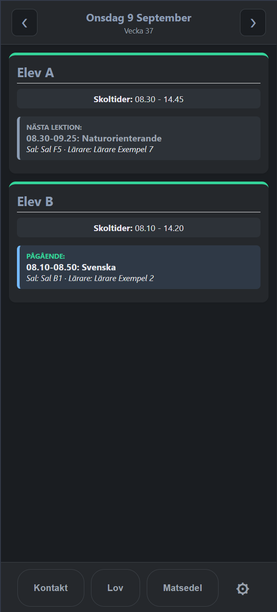

# Björklunds Skolapp

En liten PWA som samlar barnens skoldag på ett ställe: schema, pågående lektion, skollov, terminsdatum, skolmat och kontaktuppgifter till personalen.

**Live:** https://stevoxa.github.io/bjorklunds-skolapp/

Appen är byggd för mobil, fungerar offline och kan installeras på hemskärmen. All data ligger lokalt i webbläsaren — det finns ingen server och inget konto.



> Datan i repot är avsiktligt anonymiserade exempel ("Elev A", "Lärare Exempel 1"). Riktiga scheman och kontaktuppgifter läggs in genom import i appen och ska aldrig committas — se [.gitignore](.gitignore).

## Funktioner

**Dagsvy.** Ett kort per barn med skoltider och en ruta som visar pågående lektion, nästa lektion, eller att skoldagen är slut. Rutan uppdateras varje minut och när appen får fokus. Bläddra mellan dagar med pilarna i sidhuvudet eller genom att svepa; helger hoppas över automatiskt.

**Schema.** Tryck på lektionsrutan för dagens schema för det barnet, färgkodat per ämne. Sal och lärare plockas ur ämnestexten. Lärarnamnet är en genväg till kontaktlistan.

**Matsedel.** Dagens lunch hämtas från skolans RSS-flöde (t.ex. skolmaten.se) och visas på barnets kort. Knappen *Matsedel* visar hela veckan för alla barn.

**Lov.** Alla lov, helgdagar och terminshändelser i en lista, grupperad per vecka. Sammanhängande lovdagar slås ihop till perioder och passerade händelser tonas ned.

**Kontakt.** Skolpersonal per barn, sorterad på förnamn, med klickbara mail- och telefonlänkar.

**Tema.** Ljust, mörkt eller följ enheten.

## Installera som app

**iOS:** öppna sidan i Safari → Dela-ikonen → *Lägg till på hemskärmen*. iOS visar ingen automatisk installationsprompt.

**Android/Chrome:** en prompt dyker oftast upp av sig själv. Annars: webbläsarens meny → *Installera app*.

## Lägga in egen data

Öppna **⚙ → Paket → Importera paket** och välj en JSON-fil. Importen ersätter all appdata. Under *Hjälp (JSON)* finns formatbeskrivningar och en knapp som laddar ner en tom mall.

Enskilda delar kan importeras var för sig — schema, lov, terminer och kontaktlista per barn. Varje delimport sparas direkt.

**Exportera** fungerar likadant åt andra hållet och är ett bra sätt att säkerhetskopiera innan man ändrar något.

## JSON-format

### Paket (allt på en gång)

```json
{
  "bundleVersion": 1,
  "appVersion": "v51",
  "children": [
    {
      "id": "elev_a",
      "name": "Elev A",
      "rss": "https://skolmaten.se/api/4/rss/week/SKOLA?locale=sv",
      "schema": {
        "schema": [
          {
            "dag": "Måndag",
            "lektioner": [
              { "tid": "09.00-10.00", "ämne": "Matematik (A1)", "lärare": "Lärare Exempel 1" }
            ]
          }
        ]
      },
      "contacts": [
        { "name": "Lärare Exempel 1", "email": "larare1@example.com", "mobile": "+46700000001" }
      ]
    }
  ],
  "lov": {
    "lov": [{ "datum": "2026-10-26", "vecka": 44, "dag": "Måndag", "beskrivning": "Höstlov" }],
    "helgdagar": [{ "datum": "2027-03-26", "vecka": 12, "dag": "Fredag", "beskrivning": "Långfredagen" }]
  },
  "terms": [
    {
      "termin": "Höstterminen 2026",
      "skolstart": [{ "datum": "2026-08-18", "beskrivning": "Höstterminen börjar" }],
      "skolavslutning": [{ "datum": "2026-12-18", "beskrivning": "Julavslutning" }]
    }
  ]
}
```

Att tänka på:

- `dag` måste vara svensk veckodag: `Måndag`, `Tisdag`, `Onsdag`, `Torsdag`, `Fredag`.
- `tid` skrivs `HH.MM-HH.MM` eller `HH:MM-HH:MM`. Lektioner sorteras på starttid, så ordningen i filen spelar ingen roll.
- Text inom parentes sist i `ämne` tolkas som sal: `"Matematik (A1)"` visas som ämnet *Matematik*, sal *A1*.
- `lärare` är valfritt. Flera lärare skrivs som en sträng: `"Lärare A, Lärare B"`.
- `datum` är alltid `YYYY-MM-DD`. `vecka` och `dag` i lov-posterna är metadata — appen matchar på `datum`.
- Lovdagar anges **per dag**. Kalendervyn slår ihop sammanhängande datum till en period, så ta med mellanliggande helgdagar om ett lov ska visas som ett enda sammanhängande block.

### Delfiler

Schema, lov och terminer följer samma struktur som motsvarande del av paketet. Kontaktlistan är en array:

```json
[
  { "name": "Lärare Exempel 1", "email": "larare1@example.com", "mobile": "+46700000001" }
]
```

`email` och `mobile` är valfria — en kontakt med bara namn visas utan länkar.

## Hur data lagras

Allt ligger i `localStorage`:

| Nyckel | Innehåll |
| --- | --- |
| `bjorklundskolapp_store` | Barn, scheman, kontakter, lov och terminer |
| `bjorklundskolapp_food_cache` | Veckans matsedel per RSS-flöde, nycklad på veckans måndagsdatum |
| `bjorklundskolapp_food_proxy` | Vilken matproxy som fungerade senast |
| `bjorklundskolapp_theme` | Temaval |

Appdatan har ett `source`-fält som styr om den får skrivas över:

- **`seed`** — datan kommer från JSON-filerna i repot. Vid varje start hämtas de om i bakgrunden, så ändringar i repot når installerade appar. Namn, RSS och kontakter som ändrats i inställningarna behålls.
- **`custom`** — datan kommer från en import. Den rörs aldrig automatiskt.

Sparad data från äldre versioner saknar fältet och behandlas som `custom`, eftersom appen inte kan veta varifrån den kommer.

## Matsedeln

Skolmaten.se skickar `Access-Control-Allow-Origin` för sitt eget origin, så webbläsaren kan inte hämta flödet direkt — det måste gå via en CORS-proxy. Appen provar tre stycken i tur och ordning och kommer ihåg vilken som fungerade senast:

1. `api.codetabs.com`
2. `api.allorigins.win`
3. `corsproxy.io`

Är alla nere visas den senast sparade menyn med tydlig datummärkning istället för bara ett felmeddelande.

Flödet är ett **veckoflöde**, så menyn hämtas en gång per vecka och cachas på veckans måndagsdatum. Att bläddra mellan dagar, öppna veckovyn eller starta om appen ger inga nya nätverksanrop förrän veckan byts. Samtidiga hämtningar av samma flöde slås ihop till en, och efter ett misslyckande väntar appen fem minuter innan den provar hela proxykedjan igen. **⚙ → Rensa matlista** tvingar fram en ny hämtning.

Det här är appens svagaste punkt — den är beroende av gratistjänster som ligger nere ibland.

## Teknik

Inget byggsteg, inga beroenden, ingen paketerare. Hela appen är [index.html](index.html) med CSS och JavaScript inline, plus [sw.js](sw.js) och [manifest.json](manifest.json). Öppna filen i en webbläsare via en statisk server så kör den.

```bash
python -m http.server 4173
```

### Service worker

| Typ av anrop | Strategi |
| --- | --- |
| Navigering (`index.html`) | Stale-while-revalidate — snabb start, ny version hämtas i bakgrunden |
| Egen JSON | Network-first med cache som reserv, så dataändringar slår igenom direkt |
| Övriga egna filer | Cache-first |
| Tredjepart (matproxyn) | Passerar orörd — cachas aldrig |

Sista raden är viktig. Tidigare cache-firstades även tredjepartsanrop, vilket gjorde att matsedeln frös på det första svaret och aldrig uppdaterades.

### Versionshantering

`APP_VERSION` i [index.html](index.html) registrerar service workern som `./sw.js?v=<version>`, och service workern läser sitt cachenamn därifrån. En höjd version roterar alltså cachen automatiskt.

`APP_VERSION` styr **bara** cachen — den ingår inte i localStorage-nyckeln. Att höja den är därför riskfritt och rör inte importerad data. Tidigare låg nyckeln på versionen, vilket raderade allt importerat innehåll vid varje versionshöjning; data under de gamla nycklarna (`bjorklundskolapp_store_v51` och liknande) flyttas automatiskt över vid start.

En release syns för användaren så här: service workern hämtar `index.html` i bakgrunden vid varje start, jämför med den cachade kopian och meddelar sidan om den skiljer sig. Då visas en ruta som erbjuder omladdning — **på samma start**, och en omladdning räcker. Det fungerar även när bara `index.html` ändrats, alltså utan att någon ny service worker installerats.

Längst ned i inställningarna står vilken version som körs, med en knapp som kontrollerar mot servern på begäran och svarar *Appen är uppdaterad* eller *Ny version hämtad*. Kontrollen görs inne i service workern — ett `fetch` från sidan hade fångats av dess cache-first-gren och bara gett den cachade kopian tillbaka.

## Filer

```
index.html          hela appen — CSS och JS inline
sw.js               service worker, offline och caching
manifest.json       PWA-manifest
image/              appikoner, 192 och 512 px
schema_elev_a.json  exempelschema
schema_elev_b.json  exempelschema
lov_helg.json       exempel på lov och helgdagar
termin.json         exempel på terminsdatum
```
